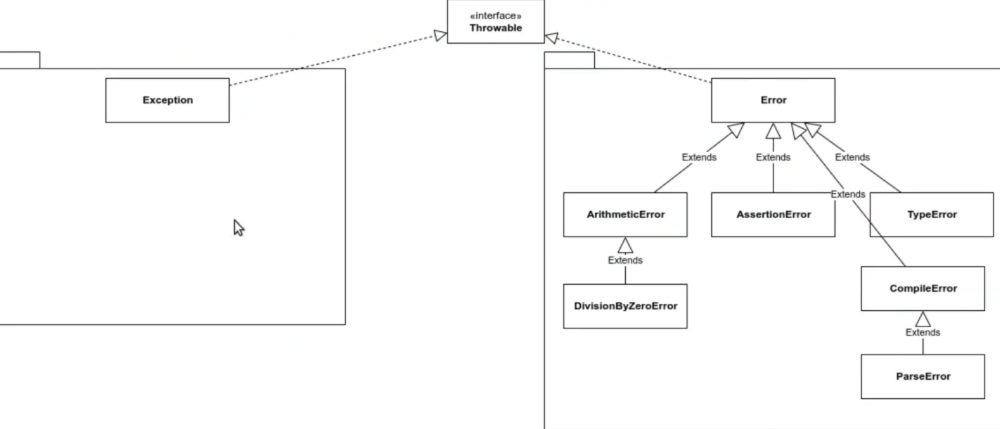

# PHP studies 🚀🐘
*** 


# Cursos
***
- [ ] PHP Exceptions: tratamento de erros
* Aprenda a lançar uma exception
* Customize uma exception
* Capture várias exceções ao mesmo tempo
* Utilize o bloco try-catch
* Veja a utilidade do bloco finally
<hr>

># Comandos e sintaxes aprendidas durante curso
***
# Pilha de execução
## Tratamento de exceções
* Agora já sabemos como fazer com que o nosso código saiba reagir quando alguma exceção acontece durante a execução.

```
try {
    $arrayFixo = new SplFixedArray(2);
    $arrayFixo[3];
} catch (RuntimeException $erro){
    echo "Aconteceu um erro na função 1" . PHP_EOL;
}
```
> Não é posssível ter uma instrução catch, sem uma instrução try
> 
> Em nosso catch nós informamos qual tipo de exceção nós queremos pegar e além disso, definimos uma variável que vai conter essa exceção.

<hr>

## Pegando mútiplas exceções
* Quando queremos personalizar todas as exception que temos podemos fazer dá seguinte maneira:
```
try {
    funcao2();
} catch (RuntimeException){
    echo 'Na função 1, eu resolvi o problema na função 2' . PHP_EOL;
} catch (DivisionByZeroError){
    echo 'Erro ao dividir um número por zero' . PHP_EOL; 
}
```
* Quando só queremos pegar a exception e não precisamos personalizar a mensagem de erro podemos fazer desssa maneira:

```
try {
    funcao2();
} catch (RuntimeException | DivisionByZeroError){
    echo 'Na função 1, eu resolvi o problema na função 2' . PHP_EOL;
}
```
 
* Podemos também pegar a mensagem de erro

```
try {
    funcao2();
} catch (RuntimeException | DivisionByZeroError $erroOuExcecao){
    echo $erroOuExcecao->getMessage() . PHP_EOL;
}
```
> Temos algumas informações que podemos pegar do erro:
* echo $erroOuExcecao->getMessage() . PHP_EOL;
* echo $erroOuExcecao->getLine() . PHP_EOL;
* echo $erroOuExcecao->getFile() . PHP_EOL;
* echo $erroOuExcecao->getTraceAsString() . PHP_EOL;

> getMessage() trás a mensagem de erro. 
> 
> getLine() trás a linha. 
> 
> getFile() trás o nome do arquivo que ocorreu o erro.
> 
> getTraceAsString() trás a pilha, todo o caminho que levou para chegar até o ponto do erro.

<hr>

### Lançar uma exceção
```
$exception = new RuntimeException();
throw $exception;
```

> 1 - Para lançar uma exceção, além de instanciá-la, é necessário lançá-la através do throw
> 
> 2- Quando uma exceção é lançada, o código para abruptamente, por padrão
> 
> 3- Podemos atribuir uma mensagem a uma exceção
> 
> 4 - Uma exceção nada mais é do que uma classe, logo, podemos instanciar exceções

### Hierarquia de exceções

> No PHP existe uma interface, chamada Throwable, que só é utilizada pelo próprio PHP, e tudo que implementa essa interface pode ser lançado por meio da palavra-chave throw. Não é possível criarmos uma classe própria que implemente diretamente a interface Throwable, ainda que seja possível criarmos classes de exceção



Falamos um pouco sobre a hierarquia dos tipos que podem ser lançados com a palavra throws, o tipo (classe ou interface) base de toda essa hierarquia é Throwable.

> Throwable essa interface é a base da hierarquia de erros e exceções do PHP.

